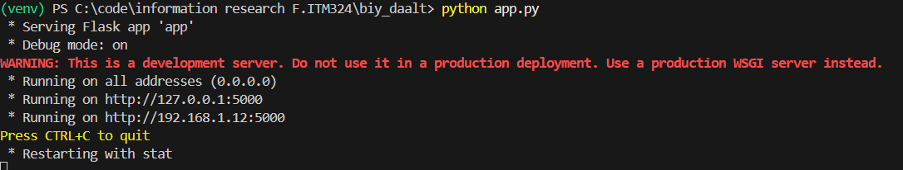
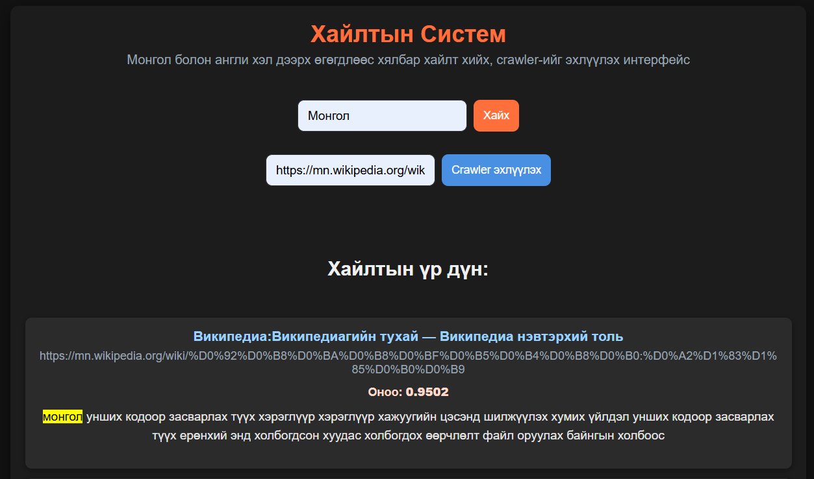
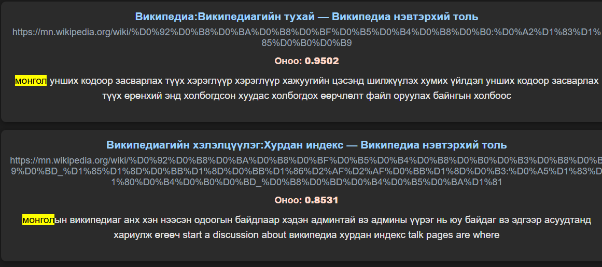

# itm_324

## Товч танилцуулга
Энэхүү төсөл нь Python сервер тал болон HTML/CSS ашигласан фронтэнд жишиг хэсгүүдээс бүрдэнэ. Энэхүү төсөл ажил нь мэдээллийн хайлтын системын хүрээнд web crawler ашиглан SEED url-ээс олон төрлийн мэдээллийг татаж аваад хэлний тодорхойлолтыг (langdec) ашиглан хэл тодорхойлсны дараа хэлний боловсруулалт хийнэ. 

## Шаардлага
- Python 3.8+
- Вэб хөтөч (браузер)
- requirements.txt

## Суулгах заавар
1. Репозиторийг клонилох:
   git clone https://github.com/Bilguun-ayurzana/itm_324.git
2. Төслийн фолдер руу орох:
   cd itm_324
3. Виртуал орчныг үүсгэх (сонголттой):
   python -m venv venv
4. Суусан Virtual орчныг ажиллуулах:
   - Windows: venv\Scripts\activate
   - macOS/Linux: source venv/bin/activate
5. Хамаарлуудыг суулгах (requirements.txt байгаа бол):
   pip install -r requirements.txt

Тэмдэглэл: Хэрэв venv эсвэл requirements.txt байхгүй бол холбогдох алхмууд шаардлагагүй болно.

## Ажиллуулах
- pyyhon app.py коммандыг ашигласнаар 

- тус лог гарч ирнэ

ctrl + c ашиглан browser дээр эсвэл ip хаягаар local development сервэр дээр нээж ажиллуулна
үүний дараа interface дээр seed_url оруулж crawl ийг эхлүүлнэ (wikipedia сайт дээр илүү сайн ажиллах боломжтой)


харагдах байдал болон үр дүн

## Фолдерийн бүтэц (Архитектур)
Доорх нь төслийн санал болгож буй дэд фолдерууд болон тэдгээрийн үүргийн товч тайлбар юм. Таны бодит репозиторид зарим фолдерууд өөр байж болох тул хэрэглээнд нийцүүлэн тохируулна уу.

```
itm_324/
├─ README.md                 # Тайлбар болон суулгах/ажиллуулах заавар
├─ requirements.txt          # Python хамаарлууд
├─ .gitignore                # Git-нд оруулахгүй файлууд
├─ crawler/                  # Web crawler эсвэл scraper код
│  ├─ __init__.py
│  ├─ fetcher.py             # URL-ээс агуулга татах логик
│  ├─ parser.py              # HTML parsing, data extraction
│  └─ seed_urls.txt          # Эхлэх SEED URL-ууд
├─ utils/                  # Хэл тодорхойлох (language detection) ба боловсруулалт
│  ├─ __init__.py
│  ├─ urls.py                # url ийг задална
│  ├─ robots.py              # url ийн хяналт
│  ├─ stopwords_en.py       
│  ├─ stopwords_mn.py      
│  └─ preprocess.py          # Текст цэвэрлэх, нормализаци хийх
├─ app.py                    # Flask root app (жишээ)
├─ static/                   # CSS, JS, images
├─ templates/                # HTML загварууд (Flask/Django templates)
├─ scripts/                  # Туслах скриптүүд (cronjob, batch runner)

- crawler/: SEED URL-уудаас веб хуудасны агуулгыг татаж, эх өгөгдлийг бүрдүүлнэ.
- langdec/: Татсан текстийн хэл тодорхойлох болон хэлэнд суурилсан өмнөх боловсруулалт хийх код.
- app/: Хэрэглэгчийн интерфейс болон API endpoint-ууд (Flask эсвэл Django-аар хэрэгжүүлнэ).
- data/: Баталгаажсан, боловсруулсан мэдээллийг хадгалах дурын форматууд (CSV/JSON/DB).
- scripts/: Төслийг автоматжуулах скриптүүд (жишээ: өдөр бүр татах, cron job).
- tests/: Кодын шинжилгээ болон шалгалтууд.

## Хүрээллийн заавар, өөрчлөлт оруулах
- Шинэ өөрчлөлт хийхдээ branch үүсгэж, pull request илгээнэ үү.
- Коммент, тест, кодын хэв маяг (PEP8) баримтлана уу.
- data/ доторх том файлууд, датаг git-д хийхээс өмнө .gitignore-д оруулахыг зөвлөж байна.

## Холбоо барих
Асуулт, санал нэмэх бол Issues хуудсанд бичнэ үү:
https://github.com/Bilguun-ayurzana/itm_324/issues

## Жич
Хүсвэл би энэ README-ийг репозиторид commit хийж, мөн бодит файлуудын дагуу фолдерын бүтэцийг автоматаар илрүүлж README-д тусгана. Commit хийхийг хүсвэл хэлнэ үү.